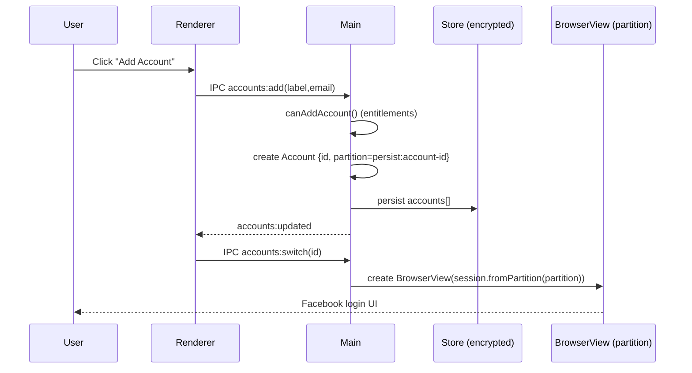
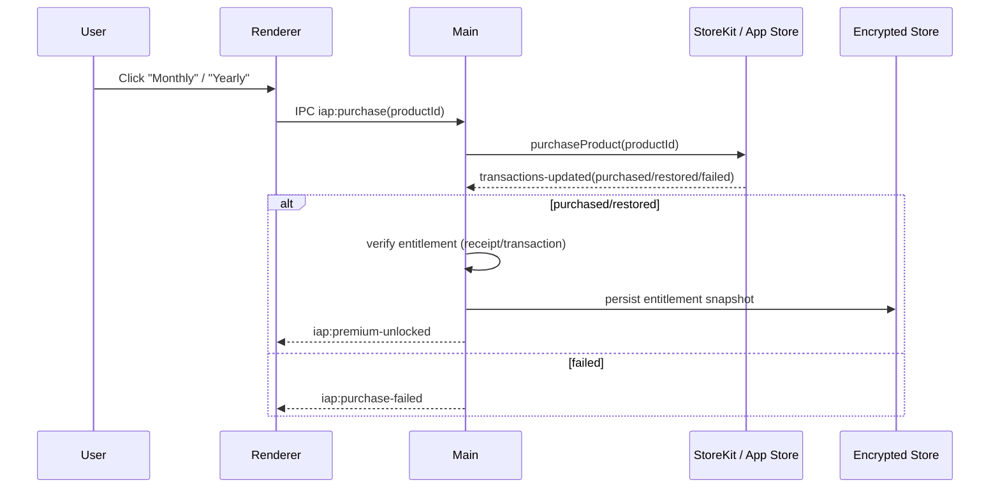

# MessengerPro (MAS-first) System Design

This document describes a Mac App Store–approvable architecture for an Electron-based Messenger wrapper with Apple subscription IAP and cross-device portability limited to *non-session* data (settings/account list), while keeping login sessions device-local.

## 0) Diagrams (Mermaid + ASCII)

### 0.1 System context (high-level)

```mermaid
flowchart LR
  user((User)) --> app[MessengerPro (Electron App)]
  app -->|BrowserView loads| web[Messenger / Facebook Web]
  app -->|Apple IAP| appstore[App Store / StoreKit]
  app -. optional .-> icloud[iCloud / CloudKit (Settings Sync)]
```

```text
User
  |
  v
MessengerPro (Electron)
  |-- BrowserView -> Messenger/Facebook Web
  |-- StoreKit -> Apple IAP (subscriptions)
  `-- (optional) CloudKit/iCloud -> sync settings/account labels
```

### 0.2 Inside the Electron app

```mermaid
flowchart TB
  subgraph Main[Electron Main Process]
    win[BrowserWindow]
    view[BrowserView (Messenger)]
    sess[Session Partitions
(persist:account-<id>)]
    store[Encrypted Store
(app-data.bin)]
    iap[IAP Manager
(StoreKit)]
    acct[Account Manager]
    ipc[IPC Handlers]
    win --> view
    view --> sess
    acct --> store
    iap --> store
    ipc --> acct
    ipc --> iap
  end

  subgraph Renderer[Renderer Process (UI)]
    ui[Sidebar / Modals / Settings UI]
    bridge[contextBridge API
(window.electronAPI)]
    ui --> bridge
  end

  bridge <--> ipc
  view -->|preload posts| ipc
```

```text
Renderer (UI)
  - Sidebar, modals
  - Calls window.electronAPI (contextBridge)
            |
            v
Main
  - IPC handlers
  - AccountManager + Store
  - IAPManager + StoreKit
  - BrowserView per active account
  - Session partitions per account
```

## 1) Goals + Non-goals

### Goals
- MAS-approvable distribution (sandboxed, no external payments, Apple IAP for subscriptions).
- Multi-account support via isolated web sessions (separate cookies/storage per account).
- Subscription-gated premium features (e.g., unlimited accounts) with reliable entitlement handling.
- Basic portability across devices for **app settings + account list metadata** (labels/colors), **not** cookie/session transfer.
- Strong privacy posture: avoid collecting sensitive user data; store local data securely.

### Non-goals (explicit)
- No syncing or transferring Facebook/Messenger login cookies or authenticated web session state across devices.
- No custom user authentication system required for the app itself (MAS-first); entitlement comes from Apple.

## 2) High-level Architecture

### Runtime components
- **Electron Main Process**
  - Owns window creation, `BrowserView` lifecycle, session partitions per account.
  - Owns persistent storage (encrypted JSON store).
  - Owns subscription/entitlement evaluation and feature gating.
  - Exposes a narrow IPC surface to renderer via `contextBridge`.

- **Electron Renderer Process**
  - Renders sidebar UI, settings, modals.
  - Calls IPC APIs for accounts, settings, purchases.
  - Never directly accesses Node APIs.

- **Messenger BrowserView (per active account)**
  - Loads `https://facebook.com` / `messenger.com`.
  - Uses `session.fromPartition('persist:account-<id>')` for isolation.
  - Uses a hardened preload (`messengerPreload`) solely for unread counts + notifications.

### Optional cloud component (MAS-friendly)
- **CloudKit / iCloud Key-Value Store (settings only)**
  - Syncs: user preferences (theme, sidebarExpanded, focus mode) + account list metadata (labels, colors), **not** partitions’ cookies.
  - User controlled: opt-in toggle (“Sync preferences across devices”).
  - This is optional; app remains fully functional without it.

## 3) Data Model

### Local persistent data (device-local)
- `settings`
  - `activeAccountId`, UI prefs, notifications prefs.
  - `theme`.
  - **Entitlement cache**: `isPremium`, `premiumExpiresAt` (or better: entitlement snapshot).

- `accounts[]`
  - `id`, `label`, `email?`, `avatarText`, `avatarColor`.
  - `partition` = `persist:account-<id>` (device-local identifier).
  - `createdAt`, `lastUsed`, `unreadCount`.

### Cloud-synced (optional)
- `settings` subset (no secrets): theme + UI toggles.
- `accounts` subset:
  - `label`, `email?` (optional), avatar styling.
  - **Do not sync** `partition` (partition is device-specific).

## 4) Key Flows

### A) Add account
1. Renderer opens “Add Account” modal.
2. Main creates an `Account` record with a new `id`.
3. Main sets `partition = persist:account-<id>`.
4. Main persists account list.
5. Main/Renderer switch to new account (create BrowserView with that partition).
6. User logs into Facebook within that view.

#### Diagram: Add account



```text
User -> Renderer: Add Account
Renderer -> Main: accounts:add
Main -> Store: save account
Main -> Renderer: accounts:updated
Renderer -> Main: accounts:switch
Main -> BrowserView: create view with partition
User logs in on web UI
```

### B) Switch account
1. Renderer calls `accounts:switch(id)`.
2. Main rebuilds BrowserView with `session.fromPartition(account.partition)`.
3. Existing cookies remain per partition.

### C) Remove account
1. Renderer calls `accounts:remove(id)`.
2. Main removes account from store.
3. Main clears partition storage via `clearStorageData()`.

### D) Subscription purchase / restore (MAS)
- Purchase
  1. Renderer requests `iap:purchase(productId)`.
  2. Main initiates StoreKit purchase.
  3. On `transactions-updated`, main processes transaction:
     - validate entitlement
     - finish transaction
     - update local entitlement cache
     - notify renderer.

- Restore
  1. Renderer requests `iap:restore`.
  2. Main calls StoreKit restore.
  3. `transactions-updated` fires restored transactions.

### E) Entitlement evaluation (critical)
- On app launch, and periodically:
  - Determine if Premium is active.
  - Enforce account limits and feature flags.

**Design recommendation (approval + correctness):**
- Prefer *Apple receipt/transaction validation* rather than a local “expiry timer”.
- Minimal option: local receipt verification using Apple APIs available in MAS context.
- Strong option: a small backend validation service (see section 6) for receipt verification + anti-tamper.

#### Diagram: Subscription purchase and entitlement update



```text
User -> Renderer -> Main: iap:purchase
Main <-> StoreKit: purchase + transactions-updated
Main: verify entitlement
Main -> Store: save entitlement
Main -> Renderer: premium unlocked/failed
```

### F) “Use on another laptop” (portability level A)
- What transfers:
  - Settings + account list metadata (optional via iCloud sync).
- What does *not* transfer:
  - Facebook login session.
- Experience:
  - User installs app on Laptop B.
  - Sees same labels (if sync enabled).
  - Must log into Facebook again per account.

#### Diagram: Cross-device portability (no session sync)

```mermaid
flowchart LR
  subgraph DeviceA[Device A]
    AStore[(Local Store
settings + account metadata)]
    ASess[(Partitions
(cookies/session))]
  end
  subgraph DeviceB[Device B]
    BStore[(Local Store
settings + account metadata)]
    BSess[(Partitions
(cookies/session))]
  end
  iCloud[(iCloud / CloudKit
optional)]
  AStore -. sync .-> iCloud
  iCloud -. sync .-> BStore
  ASess -.-x iCloud
  BSess -.-x iCloud
```

```text
Device A: settings/account labels  --> (optional iCloud) --> Device B: settings/account labels
Device A: cookies/session partitions  -- NOT SYNCED --> Device B
```

## 5) Security + Privacy

### Threat model highlights
- **Web content is untrusted**: Messenger/Facebook can run complex JS; keep it isolated in `BrowserView` with strict navigation restrictions.
- **IPC is a security boundary**: only expose whitelisted operations via `contextBridge`; validate arguments.
- **Premium enforcement should be tamper-resistant**: avoid trusting only client timers/flags for entitlement.

### Account/session privacy
- The app should not claim to store credentials.
- Each account’s login is stored only as the web session cookies in its partition (device-local).
- Removing an account should clear that partition storage.

### IPC hardening
- Maintain a small, typed `contextBridge` API surface.
- Validate all IPC inputs in main.

### Web isolation
- One session partition per account.
- `will-navigate` allowlist + `setWindowOpenHandler` to external browser.

### Storage
- Local storage encrypted via `safeStorage` where available.
- Do not store user credentials.

### Privacy disclosures (MAS)
- Be explicit that the app is a wrapper and does not access private messages beyond what the web app renders.
- State what is stored locally (labels/settings) and what is not.

## 6) Subscription system design that is App Store–approvable

### Requirements for MAS approval (practical checklist)
- Use **Apple IAP** for digital subscriptions and feature unlocking.
- No external purchase links, no Stripe, no “buy on website” CTAs in-app.
- Provide:
  - Clear product names and pricing in UI.
  - Restore purchases button.
  - Subscription terms links (EULA/Terms/Privacy).

### App Review risk areas to avoid
- **External payments**: no Stripe checkout, no “buy on website” buttons/links for digital features.
- **Misleading subscription state**: avoid showing “Premium active” solely from a local timer if StoreKit disagrees.
- **Feature gating mismatch**: free-tier limits must match what you advertise in metadata and in-app.
- **Using Meta branding**: ensure your listing and in-app copy clearly states you’re not affiliated with Meta.

### Entitlements implementation options

**Option 1: MAS-only, no backend (simpler, acceptable for many apps)**
- Rely on StoreKit transaction updates + restore flow.
- Maintain a local entitlement state, but refresh on launch.
- Risk: more susceptible to local tampering; less robust.

**Option 1A (recommended within Option 1):**
- On every launch:
  - run a restore-like check / receipt refresh when possible
  - recompute entitlements from receipt/transactions
- Keep a short offline grace window if you want better UX.

**Option 2: MAS + backend receipt validation (most robust)**
- Backend endpoints:
  - `POST /iap/verify` with receipt/transaction data.
  - Returns entitlement snapshot: `{ premium: boolean, expiresAt, productId }`.
- Main process caches server result locally.
- Still supports offline grace period.
- This is typically best for long-term reliability.

#### Backend minimal shape (if you choose Option 2 later)

```text
Client (Main) -> POST /iap/verify
  input: appAccountToken/deviceId + receipt/transaction
  output: { premium: boolean, expiresAt, productId, sourceOfTruth }
```

Notes:
- For MAS approval, this backend is fine as long as purchases are still through Apple.
- The backend is used only for verification/syncing entitlements, not for taking payments.

## 7) Feature gating strategy

- Centralize gating in main:
  - main exposes a derived `entitlements` object to renderer.
  - main enforces hard constraints (e.g., `canAddAccount`).
- Renderer only handles presentation.

### Recommended entitlements structure

```text
Entitlements
  premium:
    active: boolean
    productId?: string
    expiresAt?: number
    lastCheckedAt: number
    source: "storekit" | "receipt" | "server" | "dev"
```

## 8) Compatibility notes for your current code

- Your current design already matches:
  - per-account session partitions
  - encrypted local store
  - renderer <-> main IPC separation

- The biggest changes to become “App Store robust”:
  - Replace local `premiumExpiresAt` timer logic with receipt/transaction-based entitlement evaluation.
  - Add explicit “Sync preferences via iCloud” (optional) if you want cross-device settings.

## 10) Operational notes (testing + observability)

### Testing matrix
- **Fresh install**: no accounts, free tier behavior, upgrade CTA.
- **Purchase monthly/yearly**: unlock premium, add >1 account, restart app, premium persists.
- **Restore on new device**: install app, restore purchases, premium unlocks, account limit removed.
- **Subscription expired**: app should gracefully revert to free tier and hide extra accounts (but not delete them).
- **Offline mode**: define expected behavior (e.g., last-known entitlement with grace period).

### Logging
- Keep logs minimal and avoid storing sensitive data.
- Log entitlement refresh decisions (source, timestamps), not web content.

## 9) Sign in with Apple Integration

### Overview
- Use Apple's "Sign in with Apple" for unified identity across devices
- Premium subscription tied to Apple ID via StoreKit
- iCloud Key-Value Store for settings/workspaces sync

### Authentication Flow
1. **Welcome Screen** - User chooses "Sign in with Apple" or "Continue without signing in"
2. **Apple OAuth** - System dialog for authentication
3. **Sync Check** - Fetch iCloud data, verify subscription
4. **Main App** - Load with appropriate tier (Free/Pro)

### Premium Features

| Feature | Free | Pro |
|---------|------|-----|
| Workspaces | 1 | Unlimited |
| Accounts per workspace | 1 | Unlimited |
| Workspace customization | Limited | Full |
| iCloud sync | Basic | Full |

### Cross-Device Premium
- Same Apple ID + StoreKit subscription = premium on all devices
- "Restore Purchases" on new Mac activates premium
- Different Apple ID = separate purchase required

### Testing on Linux
- Dev mode: IAP automatically simulated (instant premium unlock)
- Allows testing: upgrade UI, feature gating, account limits

## 10) Milestones (implementation plan)

1. **Sign in with Apple**
   - Create AppleSignIn manager
   - Implement Welcome → OAuth → Onboarding flow
   - Add Apple user state to store

2. **iCloud Sync**
   - Create CloudSyncManager
   - Sync settings and workspace metadata
   - Handle conflict resolution

3. **Entitlement correctness**
   - Implement proper premium entitlement evaluation (receipt/transactions + restore on launch).

4. **MAS compliance UX**
   - Ensure upgrade screen contains required disclosures + restore + links.

5. **Settings portability (optional)**
   - Add opt-in iCloud sync for settings + account metadata (no session sync).

6. **Security hardening review**
   - Audit IPC inputs, navigation allowlist, sandbox entitlements, and privacy disclosures.
